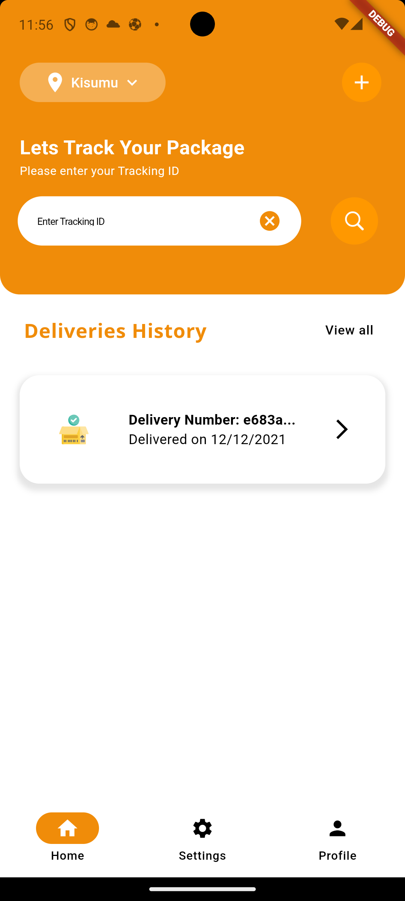
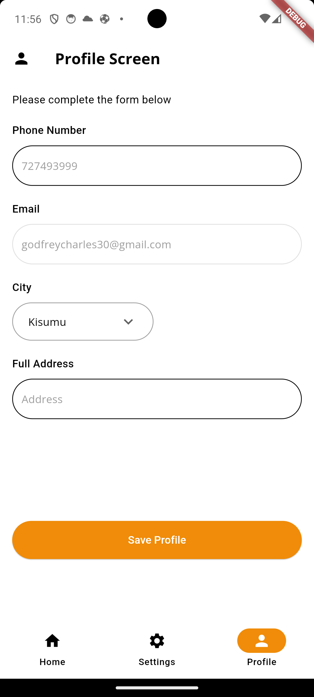
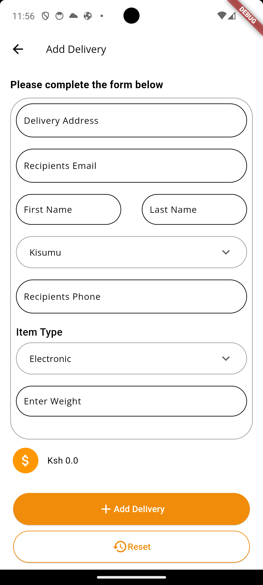
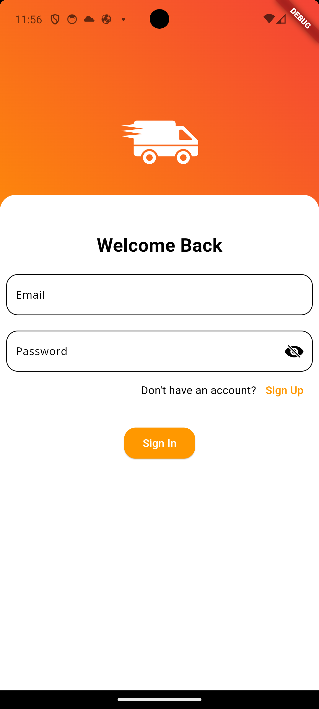

# Send Me Delivery

This is a delivery app to help cutomers send their goods with ease to their recipients. It's currently available in four cities namely Kisumu, Mombasa, Nairobi and Nakuru with a plan to expand to more locations later.


## Installation

### Prerequisites

- IDE of choice, preferably [VSCode](https://code.visualstudio.com/download).
- [Firebase](https://firebase.google.com/) for the backend services.
- [Flutter](https://docs.flutter.dev/get-started/install) Framework.

- [BloC](https://bloclibrary.dev/getting-started/) state management Library.


### How to Install
Create a folder, in that folder clone the repository as shown below.

Download flutter from the above link and follow installation steps. Configure your own firebase app.


```bash
  git clone https://github.com/juma-salim/send_me_delivery
```
After cloning the project cd into it and run it.
```bash
    cd <your_folder>
    flutter run

```
    
## Key Features
- Delivery Add page to add delivery.

- Price Tracker to ensure customers know what they will pay for
## Screenshots







